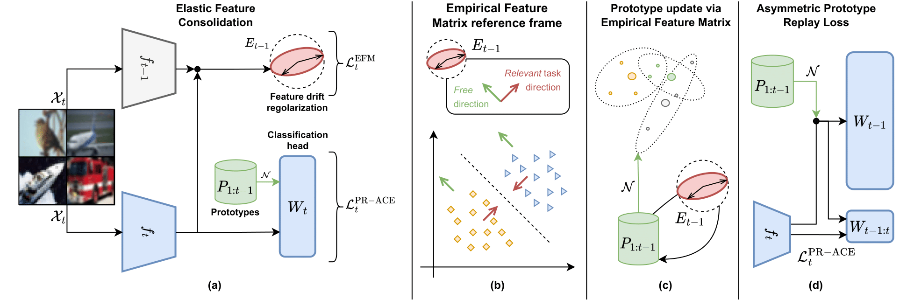
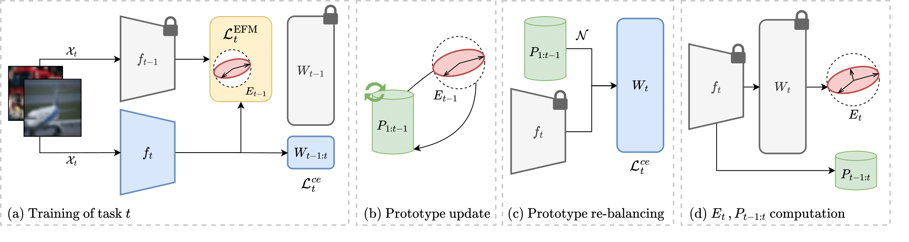

# Elastic Feature Consolidation (ICLR 2024) and EFC++ (arXiv 2025) for Exemplar-Free Incremental Learning

Official repository for our works on exemplar-free class incremental learning:


📌 **Elastic Feature Consolidation For Cold Start Exemplar-Free Incremental Learning**  (_ICLR 2024_)  
*Simone Magistri, Tomaso Trinci, Albin Soutif, Joost van de Weijer, Andrew D. Bagdanov*  
🔗 [ICLR Paper](https://openreview.net/forum?id=7D9X2cFnt1)

🔥 [26/05/2025]  **EFC++: Elastic Feature Consolidation with Prototype Re-balancing for Cold Start Exemplar-free Incremental Learning**  (_arXiv Preprint_)  
 *Simone Magistri, Tomaso Trinci, Albin Soutif, Joost van de Weijer, Andrew D. Bagdanov*  
🔗 [Preprint](https://arxiv.org/abs/2503.10439)

---

## 🔍 Overview 

### EFC (ICLR 2024) 
**Elastic Feature Consolidation** (EFC) is a method for Exemplar-Free Class-Incremental Learning that addresses feature drift by introducing the Empirical Feature Matrix (EFM) to regularize important directions in feature space, and leverages Gaussian prototypes within the Prototype Replay Asymmetric Cross-Entropy Loss (PR-ACE) to mitigate inter-task confusion and task-recency bias.



### EFC ++ (_arXiv Preprint_)
**Elastic Feature Consolidation with Prototype Re-balancing** (EFC++) extends EFC by addressing the limitations of PR-ACE in Cold Start scenarios through the introduction of a prototype re-balancing phase that separates backbone and classifier training (see the paper for more details). EFC++ outperforms EFC by more effectively managing prototypes and the plasticity introduced by the EFM.



# Cite

If this code is useful in your research, please cite :

```
@inproceedings{
magistri2024elastic,
title={Elastic Feature Consolidation For Cold Start Exemplar-Free Incremental Learning},
author={Simone Magistri and Tomaso Trinci and Albin Soutif and Joost van de Weijer and Andrew D. Bagdanov},
booktitle={The Twelfth International Conference on Learning Representations},
year={2024},
url={https://openreview.net/forum?id=7D9X2cFnt1}
}
```
and
```
@misc{magistri2025efcelasticfeatureconsolidation,
      title={EFC++: Elastic Feature Consolidation with Prototype Re-balancing for Cold Start Exemplar-free Incremental Learning}, 
      author={Simone Magistri and Tomaso Trinci and Albin Soutif-Cormerais and Joost van de Weijer and Andrew D. Bagdanov},
      year={2025},
      eprint={2503.10439},
      archivePrefix={arXiv},
      primaryClass={cs.CV},
      url={https://arxiv.org/abs/2503.10439}, 
}
```
<details>
<summary><h2>Setting up the Conda environment</h2></summary> 

To run the code you must create an Anaconda environment from the `environment.yml` file and activate it:

```
conda env create -n EFC -f environment.yml 
conda activate EFC
```
</details>


<details>
<summary><h2>Data Preparation</h2></summary> 
CIFAR-100 is automatically downloaded. Other datasets must be **manually downloaded** and placed inside the directory specified by the `--data_path` argument (default: `./cl_data`).  
The expected folder structure is:
            
```text
cl_data/
├── imagenet_subset/
│   ├── train/
│   ├── val/
│   ├── train_100.txt 
│   └── val_100.txt 
├── tiny-imagenet-200/
│   ├── train/
│   ├── val/
│   ├── wnids.txt 
│   └── words.txt  
├── DomainNet/
│   ├── {domain_name}/
│   ├── {domain_name}_train.txt
│   ├── {domain_name}_test.txt 
│   ├── cs_train_6.txt
│   └── cs_test_6.txt
└── imagenet/
    ├── train/
    └── val/
 ```
`{domain_name}` represents the  domain identifiers (e.g., `clipart`, `real`, `sketch`, etc.).

### Dataset Links

- **ImageNet Subset**  
  Download the 100-class ImageNet split from this [GitHub repository](https://github.com/arthurdouillard/incremental_learning.pytorch/tree/master/imagenet_split).

- **Tiny ImageNet**  
  Available at [http://cs231n.stanford.edu/tiny-imagenet-200.zip](http://cs231n.stanford.edu/tiny-imagenet-200.zip).

- **ImageNet-1k**  
  Download from the official [ImageNet website](https://www.image-net.org/download.php).

- **DNIL (DomainNet Incremental Learning Subset)**  
  A balanced subset of the DomainNet dataset with 600 classes and 100 classes per domain, designed for incremental learning. Proposed in:  
  > Shruthi Gowda, Bahram Zonooz, Elahe Arani.  
  > *Dual Cognitive Architecture: Incorporating Biases and Multi-Memory Systems for Lifelong Learning*.  
  > Transactions on Machine Learning Research, 2023.  

  **Setup Instructions:**
  1. Clone the DN4IL GitHub repository and rename the folder to `DomainNet`:  
     [https://github.com/NeurAI-Lab/DN4IL-dataset](https://github.com/NeurAI-Lab/DN4IL-dataset)
  2. Place it inside your `cl_data` directory.
  3. Download the full DomainNet dataset using the bash `download_domain.sh` located at scripts/
  4. Run the script `create_dn4il.py` located at:  
     `dataset/`  
     to generate the incremental learning splits: 
    
    ```bash
      cd dataset
      python create_dn4il.py --domainnet_path ../cl_data/DomainNet
    ```
</details>


 <details open>
<summary><h2>Project Description</h2></summary> 
 
This codebase is inspired by [FACIL](https://github.com/mmasana/FACIL) and is structured as follows:

- `main.py`: This script is used to run the experiments.

### Incremental Learning Modules:

- `continual_learning/IncrementalApproach.py`: This is the base class for `ElasticFeatureConsolidation` and `ElasticFeatPlusPlus`. It allows you to set optimization settings, such as the scheduler, learning rate, and optimizer, using the `OptimizerManager` class.

- `continual_learning/ElasticFeatureConsolidation.py`: This module implements Elastic Feature Consolidation. This class inherits from the `IncrementalApproach` class.

- `continual_learning/ElasticFeatPlusPlus.py`: This module implements Elastic Feature Consolidation++. This class inherits from the `IncrementalApproach` class.


### Utility Modules:

- `continual_learning/utils/OptimizerManager.py`: This class sets the optimizer for running the experiment.

- `continual_learning/utils/empirical_feature_matrix.py`: This code is responsible for computing the Empirical Feature Matrix.

- `continual_learning/utils/proto.py`: This module contains the prototype generator class.

- `continual_learning/models/BaseModel.py`: This module defines the incremental model.

- `continual_learning/utilities`: This directory contains various scripts to compute metrics. The `SummaryLogger` generates the `summary.csv` file, while the `Logger` class generates accuracy matrices for each task.

### Analyzing the Results

The results are stored in the path specified by the `-op` flag. A file named `summary.csv` will be generated, which contains the following performance metrics:

- `Per_step_taw_acc`: Per-step task-aware accuracy after each task.

- `Last_per_step_taw_acc`: Per-step task-aware accuracy after the last task.

- `Per_step_tag_acc`: Per-step task-agnostic accuracy after each task.

- `Last_per_step_tag_acc`: Per-step task-agnostic accuracy after the last task.

- `Average_inc_acc`: Average incremental accuracy.

 
### Main Command-Line Arguments

Use the following command-line arguments to configure the behavior of the code:

- `-op`: The folder path where results are stored. The name of the experiment is randomly generated.
- `--nw`: Number of workers for data loaders.
- `--epochs_first_task`: Number of epochs for the first task (default=100).
- `--epochs_next_task`: Number of epochs for tasks after the first one (default=100).
- `--seed`: Random seed (default=0).
- `--device`: GPU device to use (default=0).
- `--n_task`: Number of tasks, including the first task.
- `--n_class_first_task`: Number of classes in the first task.
- `--efc_lamb`: Lambda value associated with the empirical feature matrix (default=10).
- `--efc_damping`: Eta value as described in the main paper (default=0.1).
- `--efc_protoupdate`: Whether to update the prototype using the empirical feature matrix with a specified sigma for the Gaussian kernel. If set to -1, no prototype update is performed (default=0.2).
- `--dataset`: Dataset name (default=cifar100).
- `--data_path`: The data folder where imagenet subset and tiny-imagenet datasets are stored.
- `--firsttask_modelpath`: Start the training from a checkpoint for the first task if available.
- `--balanced_bs`: Batch size for prototype re-balancing in EFC++ (default=256).
- `--balanced_epochs`: Number of epochs for prototype re-balancing in EFC++ (default=50).
- `--balanced_lr`: Learning rate for prototype re-balancing in EFC++ (default=1e-3).

</details>


<details open> 
<summary><h2>Running the code for CIFAR-100 experiments - Cold-Start (CS)</h2></summary> 

The default hyperparameters are the ones used to compute the results in the tables of the main papers.


1. 10 Step

```
# EFC
python -u   main.py -op ./cs_cifar100_10step_efc --dataset cifar100 --approach efc --n_task 10 --n_class_first_task 10 --nw 12 --seed 0 --epochs_first_task 100  --epochs_next_task 100

```
```
# EFC++
python -u   main.py -op ./cs_cifar100_10step_efcplusplus --dataset cifar100 --approach efc++ --n_task 10 --n_class_first_task 10  --nw 12 --seed 0 --epochs_first_task 100  --epochs_next_task 100

```


2. 20 Step

```
# EFC
python -u   main.py -op ./cs_cifar100_20step_efc   --dataset cifar100 --approach efc  --n_task 20 --n_class_first_task 5   --nw 12 --seed 0 --epochs_first_task 100  --epochs_next_task 100
```

```
# EFC++
python -u   main.py -op ./cs_cifar100_20step_efcplusplus   --dataset cifar100 --approach efc++  --n_task 20 --n_class_first_task 5  --nw 12 --seed 0 --epochs_first_task 100  --epochs_next_task 100
```
</details>


<details> 
<summary><h2>Running the code for CIFAR-100 experiments - Warm-Start (WS)</h2></summary> 

The default hyperparameters are the ones used to compute the results in the tables of the main papers.


1. 10 Step

```
# EFC
python -u   main.py -op ./ws_cifar100_10step_efc --approach efc --dataset cifar100 --n_task 11 --n_class_first_task 50 --nw 12 --seed 0 --epochs_first_task 100  --epochs_next_task 100 
```

```
# EFC++
python -u   main.py -op ./ws_cifar100_10step_efcplusplus --approach efc++ --dataset cifar100 --n_task 11 --n_class_first_task 50   --nw 12 --seed 0 --epochs_first_task 100  --epochs_next_task 100 

```

2. 20 Step

```
# EFC
python -u   main.py -op ./ws_cifar100_20step_efc  --approach efc --dataset cifar100 --n_task 21 --n_class_first_task 40  --nw 12 --seed 0 --epochs_first_task 100  --epochs_next_task 100 
```
```
# EFC++
python -u   main.py -op ./ws_cifar100_20step_efcplusplus  --approach efc++ --dataset cifar100 --n_task 21 --n_class_first_task 40  --nw 12 --seed 0 --epochs_first_task 100  --epochs_next_task 100 

```

</details>


<details> 
<summary><h2> Running other experiments</summary>

The commands are similar, with the only difference being the need to specify the `cl_data` folder using the `--data_path` argument, where the datasets should be stored. The bash scripts `experiments_efc.sh` and `experiments_efcplusplus.sh`, located in `scripts/`, provide example snippets for running other experiments.


```
nohup bash experiments_efc.sh all_exp_efc > all_exp_efc.txt & 
```
 

```
nohup bash experiments_efcplusplus.sh all_exp_efcplusplus > all_exp_efcplusplus.txt & 
```

These commands store all experiment outputs—each identified by a folder with a random name—inside the folder specified in the bash script argument (e.g., all_exp_efc or all_exp_efcplusplus). After the script finishes, all the `summary.csv` files can be aggregated to generate plots or summarize the results. 

The following command aggregates the results from the folder `all_exp_efcplusplus`, generating a file named `all_summary.csv` inside it:

```bash
python aggregate_summaries.py --base_path  all_exp_efcplusplus
```

To run experiments with multiple seeds, it can be useful to create a bash script that iterates over the seeds, and running it as described above.

</details>

<details> 
<summary><h2> Loading a checkpoint after the first task.</summary>

The command `--firsttask_modelpath` allows to load a model pre-trained  after the first task checkpoint if available. In this way the first task can be skipped and this can help to steamline  incremental experiments for research code if multiple experiments should be run. For doing this, suppose the models are stored in the folder `./cl_models` inside the project directory. Run the bash script `create_first_checkpoints_folder.sh` , which creates a folder with the following structure:

```text
cl_models/
├── cifar100/
│   ├── 5_class/
|   |     ├── seed_0/
|   |     ├── seed_1/
|   |     ├── seed_2/
|   |     ├── seed_3/
|   |     └── seed_4/
|   |      
│   ├── 10_class/
│   ├── 40_class/
│   └── 50_class/
├── tiny-imagenet/
│   ├── 10_class
│   ├── 20_class
│   └── 100_class 
├── imagenet-subset/
│   ├── 5_class/
│   ├── 10_class/
│   ├── 40_class/
│   └── 50_class/
├── imagenet-1k/
│   ├── 50_class
│   ├── 100_class
│   ├── 400_class
│   └── 500_class  
└── domainnet/
    └── 100_class
```

- Each `{x}_class/` folder corresponds to the number of classes used in the **first task** training.
  - Example mappings:
    - CIFAR-100 CS, 10 steps → use `10_class/`
    - CIFAR-100 CS, 20 steps → use `5_class/`
    - CIFAR-100 WS, 10 steps → use `50_class/`
    - CIFAR-100 WS, 20 steps → use `40_class/`
- Within each class folder, subdirectories `seed_0/`, `seed_1/`, ..., `seed_4/` are used to distinguish different random seeds.
- Each folder must contain the pretrained model named exactly as: `0_model.pth`. This name is the one currently used by the code to store the models.

 
### Example Usage

Suppose you've trained the first task of CIFAR-100 CS with 10 steps and seed 0, and saved the checkpoint at: `./cl_models/cifar100/10_class/seed_0/0_model.pth`.


You can skip first-task training and run the experiment with the following command:

```bash
python -u main.py -op ./cs_cifar100_10step_efcplusplus \
  --dataset cifar100 \
  --approach efc++ \
  --n_task 10 \
  --n_class_first_task 10 \
  --nw 12 \
  --seed 0 \
  --firsttask_model_path ./cl_models \
  --epochs_first_task 100 \
  --epochs_next_task 100
```

⚠️ Make sure the values of  `--seed`, `--dataset`, `--n_task`, and `--n_class_first_task` match the configuration used to train the first-task checkpoint.


# License

Please check the MIT license that is listed in this repository.


