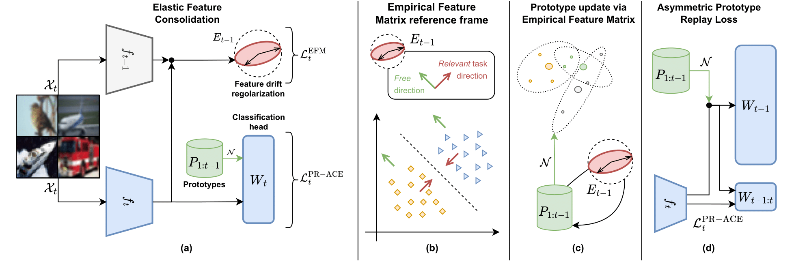

# Elastic Feature Consolidation For Cold Start Exemplar-Free Incremental Learning



This repository contains all code needed to reproduce the experimental results in Elastic Feature Consolidation For Cold Start Exemplar-Free Incremental Learning, accepted at ICLR 2024.


# Setting up the Conda environment

To run the EFC code you must create an Anaconda environment from the `environment.yml` file and activate it:

```
conda env create -n EFC -f environment.yml 
conda activate EFC
```

# Running the code for CIFAR-100 experiments - Warm-Start (WS)

The default hyperparameters are the ones used to compute the Table 1 in the main paper.


1. 10 Step

```
python -u   main.py -op ./ws_cifar100_10step --dataset cifar100 --n_task 11 --n_class_first_task 50 --approach efc  --nw 12 --seed 0 

```

2. 20 Step

```
python -u   main.py -op ./ws_cifar100_20step --dataset cifar100 --n_task 21 --n_class_first_task 40 --approach efc  --nw 12 --seed 0 

```

# Running the code for CIFAR-100 experiments - Cold-Start (CS)

The default hyperparameters are the ones used to compute the Table 1 in the main paper.


1. 10 Step

```
python -u   main.py -op ./cs_cifar100_10step --dataset cifar100 --n_task 10 --n_class_first_task 10 --approach efc --epochs 100 --nw 12 --seed 0 

```

2. 20 Step

```
python -u   main.py -op ./cs_cifar100_20step   --dataset cifar100 --n_task 20 --n_class_first_task 5 --approach efc --epochs 100 --nw 12 --seed 0 

```


# Running the Tiny-Imagenet and ImageNet-Subset experiments

The commands are similar, the only difference is that  the  data-folder "cl_data" where both the datasets are downloaded should be specified.

Here the 10-step and 20-step scenario **Warm Start** (WS) for Tiny-ImageNet and ImageNet-Subset.

```
python -u   main.py -op ./ws_tinyimagenet_10step  --dataset tiny-imagenet  --n_task 11  --n_class_first_task 100 --approach efc  --nw 12 --seed 0 --data_path ./cl_data
```

```
python -u   main.py -op ./ws_imagenetsubset_10task --dataset imagenet-subset  --n_task 11  --n_class_first_task 50 --approach efc   --nw 12  --seed 0 --data_path ./cl_data
```

```
python -u   main.py -op ./ws_tinyimagenet_20step  --dataset tiny-imagenet  --n_task 21  --n_class_first_task 100 --approach efc  --nw 12 --seed 0 --data_path ./cl_data
```

```
python -u   main.py -op ./ws_imagenetsubset_20task --dataset imagenet-subset  --n_task 21  --n_class_first_task 40 --approach efc   --nw 12  --seed 0 --data_path ./cl_data
```

Here the 10-step and 20-step scenario **Cold Start** (CS) for Tiny-ImageNet and ImageNet-Subset.

```
python -u   main.py -op ./ws_tinyimagenet_10step  --dataset tiny-imagenet  --n_task 10  --n_class_first_task 20 --approach efc  --nw 12 --seed 0 --data_path ./cl_data
```

```
python -u   main.py -op ./ws_imagenetsubset_10step --dataset imagenet-subset  --n_task 10  --n_class_first_task 10 --approach efc   --nw 12  --seed 0 --data_path ./cl_data
```

```
python -u   main.py -op ./ws_tinyimagenet_20step  --dataset tiny-imagenet  --n_task 20  --n_class_first_task 10 --approach efc  --nw 12 --seed 0 --data_path ./cl_data
```

```
python -u   main.py -op ./ws_imagenetsubset_20step --dataset imagenet-subset  --n_task 20  --n_class_first_task 5 --approach efc   --nw 12  --seed 0 --data_path ./cl_data
```


In the bash file "experiments.sh" all the experiments for all the scenarios can be run.

# Main command-line arguments

* `-op`: folder path where results are stored
* `--nw`: number of workers for data loaders
* `--epochs`: total number of epochs for the incremental steps (default=100)
* `--seed`: random seed (default=0)
* `--n_task`:  number of task, included the  first task
* `--n_class_first_task`:  number of classes in the first task
* `--efc_lamb`:  lambda associated to empirical feature matrix (default=10)
* `--efc_damping`: eta in the main paper (default=0.1)
* `--efc_protoloss`: wheter to use a symmetric proto loss or asymmetric protoloss (default="asymmetric")
* `--efc_protoupdate`: wether to update the prototype using the empirical feature matrix with a specified sigma for the gaussian kernel, if -1 it is specified no prototype update is performed (default=0.2)
* `--data_path`: data folder where imagenet subset and tiny-imagenet are stored.

# Analyzing the results

The results are stored in path specified by `-op`.  A file
`summary.csv` with the command line arguments and the performance will
be generated. The last column
'Last_avg_perstep_tag_acc` represent the last per step incremental accuracy (Left Formula in Equation 16 in
the main paper). The average incremental accuracy can be derived averaging the per-step incremental accuracy across the steps (Right Formula in Equation 16 in the main paper)

# The Empirical Feature Matrix (EFM)

The code for computing the Empirical Feature Matrix is in `continual_learning/utils/empirical_feature_matrix.py`.
